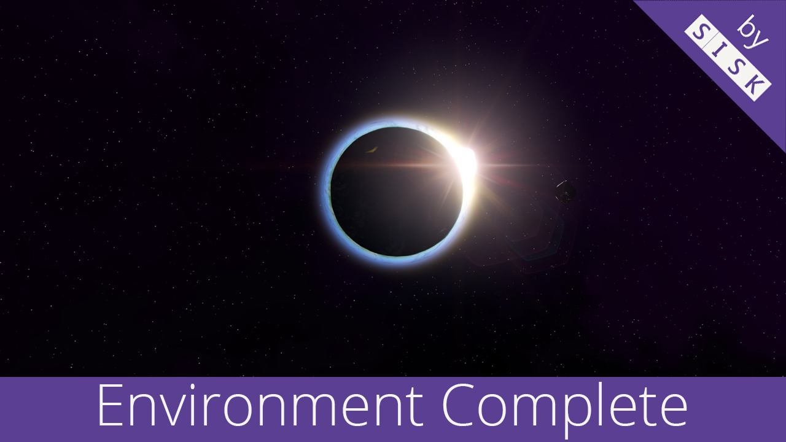

# Sisk's Environment Complete

Hey engineers,

today I'm finally ready to release a "big" update, but first a big thanks to [Digi](https://steamcommunity.com/id/hunterdigi/myworkshopfiles/?appid=244850&sort=score&browsefilter=myfiles&view=imagewall) for pointing out the profiler build.

In this update, among other things, I've improved directional lighting and the resulting shadows, Eye Adaptation to better match my sun intensity, and I've adjusted Bloom a bit more.

I have set up a comparison gallery that you can view [here](https://sisksjet.github.io/SisksEnvironmentComplete/)

* * *

This is my complete environment package with a dark sky box containing purple nebula, modified environment lighting and custom sun rays and flares.

If you do not like the Skybox or you do not want modified sun rays, check out the collection above. It includes  Skybox, Sun and Environment as seperate mods. They can be combined so that you can build your Skybox to your liking.

**This Sky Box does not contain a Speed Mod.**

## Features

* Dark skybox with purple nebula in 4K
* Custom sun rays and lense flare
* Reduces and modified "screen dirt"
* Darker dark sides
* Improved directional light and shadows
* Less Bloom

## TODO

* Reduce or remove "colored atmospheric fog" between dark and lighten side of planets
